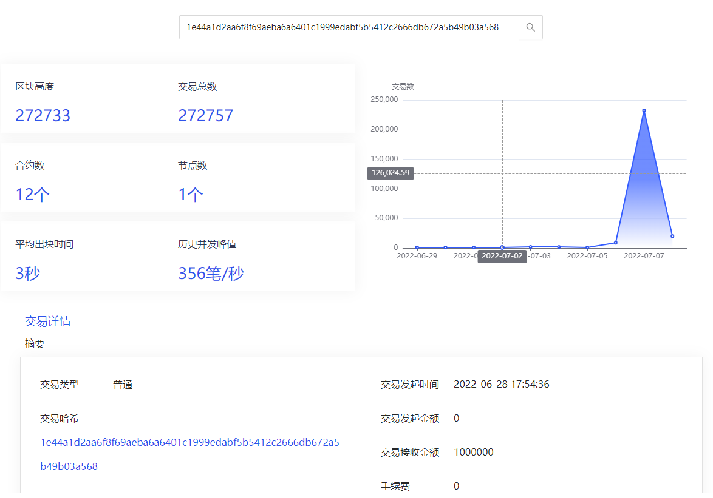

# Front_ChainEye
链眼(ChainEye) 前端项目

## 项目路径
项目路径： [front_chaineye](https://github.com/shengjian-tech/front_chaineye).

## 预览


## 环境准备

```
node: v16.13.0
npm: 8.1.0
```
## 依赖安装

```
npm install
```
## 打包

```
npm run build
```

## Nginx Server 配置
```
server {
    listen       8765;
    server_name  _;

    location ~ ^/front_chaineye/ {
            root html;
            index  index.html index.htm;
            try_files $uri $uri/ /front_chaineye/index.html;
        }        
    
	location ~ ^/chaineye/ {
	    proxy_set_header                Host                            $host;
            proxy_set_header                X-Real-IP                       $remote_addr;
            proxy_set_header                X-Forwarded-For                 $proxy_add_x_forwarded_for;
	    proxy_pass http://127.0.0.1:18000;
        }
}
```
## 其他设置
- [env](.env)文件配置 `VITE_PREFIX = '/front_chaineye'` 配置前端访问路径统一前缀, `VITE_SHOW_MENU = false` 配置左侧菜单栏是否显示, `true`显示。  
- [request.ts](./src/utils/request.ts)中配置`backendBaseUrl = '/chaineye'`, 即请求后端服务统一添加 `/chaineye` 前缀。需要与链眼(chaineye)后端接口前缀一致。

## 注意
- `vite.config.js` and `tsconfig.json` should both configure to make sure alias works
- Add `"css.validate": false` in vscode setting.json to ignore the css warning 

## 鸣谢
[nightingale fe-v5](https://github.com/n9e/fe-v5)

